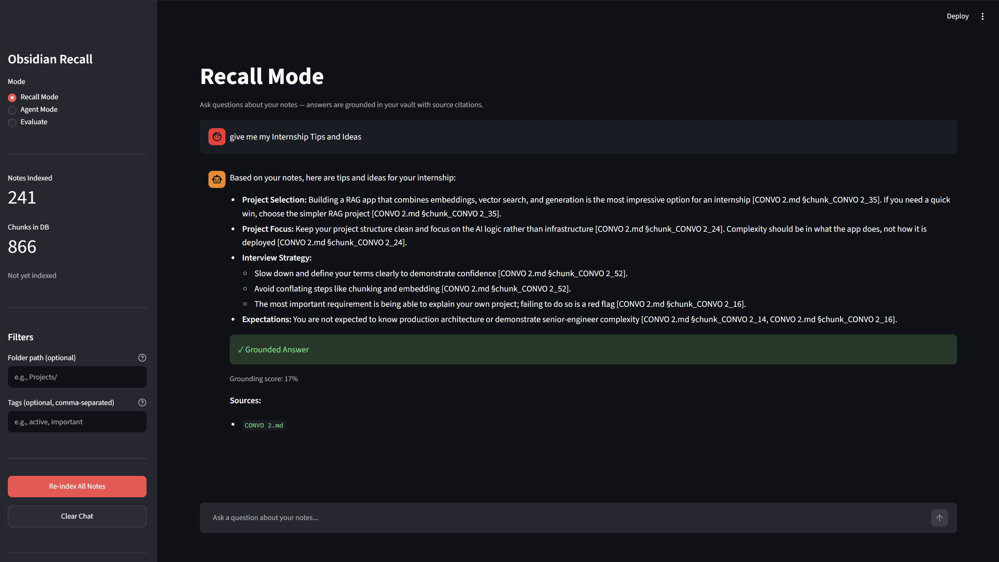
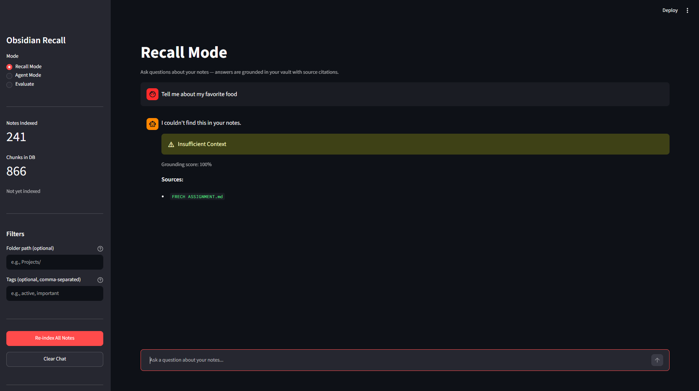

# Obsidian Recall

Self-hosted RAG pipeline for your Obsidian vault. Ask questions in natural language and get answers grounded in your notes with inline citations and confidence scores. Automate vault management with a confirmation-gated agent.

Powered by hybrid retrieval (BM25 + local embeddings), cross-encoder reranking, and your choice of LLM provider — Gemini Flash Lite (free tier) or opencode-Go.



---

## Features

- **Three modes** — Recall (Q&A), Agent (autonomous note management), Evaluate (RAG metrics)
- **Hybrid retrieval** — BM25 keyword scoring + embedding similarity (50/50), cross-encoder reranking on top 20 candidates
- **Citation-strict answers** — inline `[doc_title §chunk_id]` references with grounding scores
- **Confidence thresholds** — rejects low-confidence retrieval early to prevent hallucination
- **Metadata filtering** — filter by folder path and tags from the sidebar
- **Incremental indexing** — MD5 hash tracking; only re-indexes changed files
- **LLM provider switching** — swap between Gemini Flash Lite (free tier) and opencode-Go (sk-key auth) with one env var
- **Auto-reindex** — optional watchdog file watcher picks up vault changes in real time
- **12 agent tools** — read, create, edit, rename, move, merge, add_tag, delete, find_duplicates, find_broken_links, search_notes
- **Automatic vault backups** — agent sessions snapshot your vault before any writes
- **RAG evaluation suite** — Recall@K, Precision@K, Faithfulness metrics for tuning
- **Docker Compose stack** — app + opencode server + rclone sync sidecar

---



## Quick Start

```bash
git clone https://github.com/LXW1205/obsidian_recall.git
cd obsidian_recall

cp .env.example .env
# Edit .env — add your GOOGLE_API_KEY at minimum

docker compose up -d
```

Open **http://localhost:8501** in your browser.

> The first query downloads two models: the embedding model `all-MiniLM-L6-v2` (~90 MB) and the cross-encoder reranker `ms-marco-MiniLM-L-6-v2` (~90 MB). Subsequent queries are fast. Set `HF_TOKEN` in `.env` for faster Hugging Face downloads.

---

## Configuration

Copy `.env.example` to `.env` and configure:

| Variable | Required | Default | Description |
|---|---|---|---|
| `GOOGLE_API_KEY` | Yes | — | Google AI Studio key (Gemini LLM) |
| `HF_TOKEN` | No | — | Hugging Face token (faster model downloads) |
| `LLM_PROVIDER` | No | `gemini` | `gemini` or `opencode` |
| `OPENCODE_URL` | No | `http://opencode:4096` | Opencode server URL |
| `OPENCODE_PROVIDER` | No | `opencode-go` | Provider ID from your opencode account |
| `OPENCODE_GO_API_KEY` | No | — | Programmatic auth key for opencode-Go |
| `VAULT_PATH` | No | `/app/notes` | Vault mount path inside the container |
| `CHROMA_PATH` | No | `/app/chroma` | ChromaDB persistence directory |

### LLM Provider Options

**Gemini (default, free tier):**
```env
LLM_PROVIDER=gemini
GOOGLE_API_KEY=AIza...
```

**Opencode-Go (subscription):**
```env
LLM_PROVIDER=opencode
OPENCODE_URL=http://opencode:4096
OPENCODE_PROVIDER=opencode-go
OPENCODE_GO_API_KEY=sk-...
```

The system falls back to Gemini if the opencode server is unreachable.

---

## Usage

### Recall Mode (Q&A)

The primary mode. Type a question about your notes — the system retrieves relevant chunks, reranks them, generates an answer, and validates citations.

Each response shows:
- A **grounding score** (0–1.0) measuring how well the answer aligns with the retrieved context
- An **answer label** — `highly_grounded`, `partially_grounded`, or `insufficient_context`
- **Inline citations** pointing to specific notes and sections

Use the sidebar to filter by folder path or tags.

### Agent Mode (Note Management)

Give natural language instructions like:
- "Merge all daily notes from last week into a weekly summary"
- "Rename all files in /Inbox to lowercase"
- "Move all meeting notes to /Meetings"

The agent:
1. Plans a sequence of tool calls (JSON-based, not function calling)
2. Presents the plan in a confirmation panel
3. Backs up your vault automatically
4. Executes after you approve
5. Re-indexes any changed files after writes

### Evaluate Mode (RAG Metrics)

Paste a JSON array of test queries:

```json
[
  {
    "query": "How does chunking work?",
    "expected_sources": ["Chunking.md"],
    "reference_answer": "Chunking splits documents into smaller pieces..."
  }
]
```

Get per-query and aggregate metrics: Recall@K, Precision@K, Faithfulness, and a hit/partial_hit/miss classification.

---

## Architecture

```
┌──────────┐   rclone sync    ┌──────────┐
│ Google   │ ───────────────→ │  Vault   │
│ Drive    │   (every 5 min)  │  Volume  │
└──────────┘                  └────┬─────┘
                                   │
                            ┌──────▼──────┐
                            │   Ingest    │
                            │ (incremental│
                            │  indexing)  │
                            └──────┬──────┘
                                   │
                    ┌──────────────┼──────────────┐
                    │              │              │
              ┌─────▼─────┐ ┌─────▼─────┐ ┌──────▼─────┐
              │  ChromaDB │ │   BM25   │ │  Hashes   │
              │(embeddings)│ │ (keyword) │ │ (MD5 map) │
              └─────┬─────┘ └─────┬─────┘ └────────────┘
                    │              │
                    └──────┬──────┘
                           │ hybrid score (50/50)
                    ┌──────▼──────┐
                    │  Reranker   │
                    │ (cross-enc) │
                    └──────┬──────┘
                           │ top 5
                    ┌──────▼──────┐
                    │  LLM (gemini│
                    │  or opencode)│
                    └──────┬──────┘
                           │ answer + citations
                    ┌──────▼──────┐
                    │  Grounding  │
                    │  Validation │
                    └──────┬──────┘
                           │
                    ┌──────▼──────┐
                    │  Streamlit  │
                    │     UI      │
                    └─────────────┘
```

---

## Project Structure

```
obsidian_recall/
├── app/                       # Application code
│   ├── app.py                 # Streamlit UI — all three modes
│   ├── ingest.py              # Indexing pipeline, ChromaDB writes
│   ├── query.py               # Hybrid retrieval + LLM generation
│   ├── agent.py               # Agent planning + execution loop
│   ├── tools.py               # 12 file operation tools
│   ├── bm25.py                # BM25 keyword scoring index
│   ├── grounding.py           # Citation validation + answer labels
│   ├── rerank.py              # Cross-encoder reranker wrapper
│   ├── evaluate.py            # RAG evaluation metrics
│   ├── opencode_client.py     # HTTP client for opencode server API
│   └── watcher.py             # Watchdog file watcher
├── tests/                     # Pytest suite (59 tests)
│   ├── conftest.py            # Shared fixtures
│   ├── test_bm25.py           # BM25 index tests
│   ├── test_grounding.py      # Grounding validation tests
│   ├── test_evaluate.py       # Evaluation metric tests
│   ├── test_query.py          # Query pipeline tests
│   ├── test_agent.py          # Agent planning tests
│   └── test_opencode_client.py # opencode HTTP client tests
├── data/chroma/               # ChromaDB persistence (gitignored)
├── backups/                   # Agent mode vault backups (gitignored)
├── docker-compose.yml         # obsidian-recall + opencode + rclone-sync
├── Dockerfile                 # python:3.11-slim image with tests
├── screenshots/               # README screenshots (see below)
├── requirements.txt           # Python dependencies
├── .env.example               # Configuration template
├── .gitignore
└── README.md
```

---

## Dependencies

- **Python 3.11** (slim Docker image)
- **Google Gemini API** — `gemini-flash-lite-latest` as the default LLM (free tier)
- **ChromaDB** — vector store for embedding persistence
- **sentence-transformers** — `all-MiniLM-L6-v2` for local embeddings, `cross-encoder/ms-marco-MiniLM-L-6-v2` for reranking
- **Streamlit** — browser UI
- **opencode-Go** — optional LLM provider (sk-key auth)
- **rclone** — optional Google Drive sync sidecar

---

## Development

```bash
# Install dependencies
pip install -r requirements.txt

# Run tests
python -m pytest tests/ -v

# Or from Docker
docker compose exec obsidian-recall python -m pytest tests/ -v
```

---

## Deployment (Remote Server)

1. **Install Docker + Docker Compose** on your server
2. **Clone the repo** and create `.env` with your API keys
3. **Authenticate rclone** (one time, interactive):

```bash
docker run --rm -it \
  -v ~/.config/rclone:/config/rclone \
  rclone/rclone config
```

Create a remote named `gdrive` pointing to your Obsidian vault folder.  
Edit the remote name and folder path in `docker-compose.yml` if they differ from `gdrive:YOUR_FOLDER_NAME`.

4. **Start the stack:**

```bash
docker compose up -d
```

5. **Access the UI** at `http://your-server:8501`

The `rclone-sync` container syncs from Google Drive every 5 minutes. ChromaDB and backups persist inside the `data/` directory.

---

## Screenshots

| Screen | Description |
|---|---|
| `screenshots/recall-mode.png` | Recall Mode with a grounded answer, confidence score, inline citations, and sidebar filters |
| `screenshots/insufficient-context.png` | Low-confidence query showing `insufficient_context` label |
| `screenshots/agent-mode.png` | Agent Mode confirmation panel with the planned tool calls before execution |
| `screenshots/evaluate-mode.png` | Evaluate Mode showing per-query metrics and aggregate Recall/Precision/Faithfulness scores |

---

## License

MIT
